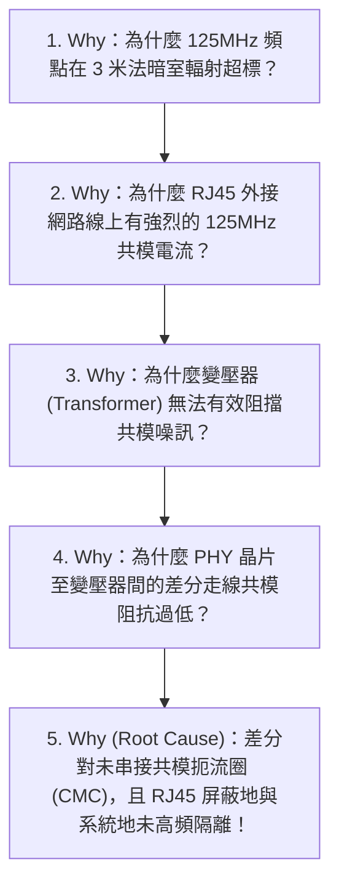

# ⚡ EMC - <% tp.file.title.replace('EMC - ', '') %>

> [!ABSTRACT] ⚡ 30 秒 EMC 認證評估速讀 (Compliance Verdict / TL;DR)
> - 🎯 **目標認證法規**：`standard_target` | **測試類別**：`issue_type`
> - 📊 **合規裕度 (Margin)**：最小通過裕度 **`min_pass_margin_db`** (要求 $\ge 3.0\text{ dB}$)
> - 🛠️ **核心整改對策**：共模扼流圈 (CMC) 濾波 + 開關節點 RC Snubber + 外殼接地彈片強化
> - 🏁 **認證狀態**：`status` | **專案**：`project` (`board_rev`) | **ECO 單號**：`eco_number`

---

## 1. 🎯 認證法規標準與測試配置 (Standards & Lab Setup)

### 1.1 適用法規與限值標準
| 認證體系 | 測試標準 (Standard) | 測試頻段 (Frequency) | 判定限值 (Class) | 最小裕度要求 (Target Margin) |
| :--- | :--- | :--- | :--- | :---: |
| **歐盟 CE** | EN 55032 / CISPR 32 | $30\text{ MHz} \sim 6\text{ GHz}$ | Class B (住宅/商用) | $\ge 4.0\text{ dB}$ |
| **美國 FCC** | FCC Part 15 Subpart B | $30\text{ MHz} \sim 18\text{ GHz}$| Class B | $\ge 4.0\text{ dB}$ |
| **靜電放電** | IEC / EN 61000-4-2 | 接觸 $\pm 4\text{kV}$, 空氣 $\pm 8\text{kV}$ | Criteria A (不中斷運作) | 100% 無異常重啟 |
| **雷擊浪湧** | IEC / EN 61000-4-5 | 線-線 $\pm 1\text{kV}$, 線-地 $\pm 2\text{kV}$ | Criteria B (自動恢復) | TVS 正常箝位 |

### 1.2 測試暗室與設備配置清單
- **測試場地**：`test_lab`（3米法半電波無響室 SAC）
- **接收機 / 天線**：R&S ESW44 EMI 測試接收機、雙錐對數週期天線 (30MHz~1GHz)、喇叭天線 (1GHz~6GHz)
- **待測物 (DUT) 運行狀態**：滿載負載 + 乙太網滿速雙向打包 + 螢幕高速顯示輸出 (Worst-Case Mode)

---

## 2. 📊 輻射與傳導發射量測頻譜 (Spectral Profile & Peaks)

### 2.1 測試頻譜圖與包絡線 (Spectral Plot)

> [!NOTE] 📈 輻射發射 (RE) 頻譜掃描結果 (30MHz ~ 1GHz)
> ![[90_System/Attachments/EMC_RE_Spectrum_Scan_DVT.png]]
> *頻譜描述：藍色曲線為垂直極化 (V)，紅色曲線為水平極化 (H)，綠色實線為 CISPR 32 Class B 限值。*

### 2.2 關鍵超標 / 臨界頻點數據表 (Peaks vs Limits)
| 頻點 (Frequency) | 極化方向 (H/V) | 實測準峰值 ($QP$) | 法規限值 (Limit) | 裕度 (Margin) | 判定 (Pass/Fail) | 噪訊源初步定位 |
| :---: | :---: | :---: | :---: | :---: | :---: | :--- |
| **$125.00\text{ MHz}$** | Vertical | $38.2\,\text{dB}\mu\text{V/m}$ | $40.0\,\text{dB}\mu\text{V/m}$ | **$+1.8\text{ dB}$** | 🟡 邊緣超標 | 千兆乙太網 PHY 參考時鐘倍頻 |
| **$250.00\text{ MHz}$** | Horizontal | $42.5\,\text{dB}\mu\text{V/m}$ | $47.0\,\text{dB}\mu\text{V/m}$ | **$+4.5\text{ dB}$** | 🟢 Pass | 乙太網二次諧波 |
| **$480.00\text{ MHz}$** | Vertical | $44.8\,\text{dB}\mu\text{V/m}$ | $47.0\,\text{dB}\mu\text{V/m}$ | **$+2.2\text{ dB}$** | 🟡 邊緣超標 | USB 2.0 高速時鐘輻射 |
| **$750.00\text{ MHz}$** | Horizontal | $39.6\,\text{dB}\mu\text{V/m}$ | $47.0\,\text{dB}\mu\text{V/m}$ | **$+7.4\text{ dB}$** | 🟢 Pass | 主開關電源高次諧波 |

---

## 3. 🔍 近場探棒定位與噪訊根因分析 (Near-Field Sniffing & RCA)

### 3.1 5-Whys 噪訊源根因推導 (5-Whys RCA)

### 3.2 物理機制解析 (Radiation Physics & Formulas)
- **電纜天線共模輻射公式**：
  $$E = \frac{1.26 \times 10^{-7} \cdot f \cdot I_{CM} \cdot L}{r}$$
  *其中 $I_{CM}$ 為電纜上的共模電流，$L$ 為外接線纜長度。實測僅需數十微安 ($\mu\text{A}$) 級別的共模電流即可導致 $30\text{ MHz} \sim 300\text{ MHz}$ 輻射超標！*

---

## 4. 🛠️ 整改對策與實驗驗證 (Countermeasures & Verification)

### 4.1 整改實驗矩陣 (Experiment Trials)
| 實驗輪次 | 導入之整改對策 (Countermeasures) | $125\text{MHz}$ 裕度改善 ($\Delta \text{dB}$) | 副作用 / 溫升評估 | 採納狀態 |
| :---: | :--- | :---: | :--- | :---: |
| **Trial 1** | 在 RJ45 電纜外側加扣 TDK 夾扣式鐵氧體磁環 | $+5.2\text{ dB}$ | 外部線纜成本增加，非量產根治解 | 🟡 驗證用 |
| **Trial 2** | 乙太網 MDI 差分對串接貼片式共模扼流圈 (CMC) | $+6.8\text{ dB}$ | 差分眼圖無退化，信號品質良好 | 🟢 **採納 (Schematic)** |
| **Trial 3** | DC-DC SW 開關節點增設 RC Snubber ($2.2\Omega + 470\text{pF}$) | $+3.5\text{ dB}$ (高頻區) | 電源效率微幅下降 0.4%，結溫正常 | 🟢 **採納 (Layout)** |
| **Trial 4** | 主控晶片頂部加裝沖壓金屬屏蔽罩 (Shielding Can) | $+8.0\text{ dB}$ (全頻段) | SMT 需預留屏蔽框焊盤 | 🟢 **採納 (Mechanical)** |

### 4.2 整改前 vs 整改後數據對比
| 關鍵頻點 | 整改前實測 (Before) | 整改後實測 (After) | 改善幅度 ($\Delta \text{dB}$) | 最終裕度 (Final Margin) |
| :---: | :---: | :---: | :---: | :---: |
| **$125.00\text{ MHz}$** | $38.2\,\text{dB}\mu\text{V/m}$ | **$31.4\,\text{dB}\mu\text{V/m}$** | **$+6.8\text{ dB}$** | 🟢 **$+8.6\text{ dB}$ (Pass)** |
| **$480.00\text{ MHz}$** | $44.8\,\text{dB}\mu\text{V/m}$ | **$37.5\,\text{dB}\mu\text{V/m}$** | **$+7.3\text{ dB}$** | 🟢 **$+9.5\text{ dB}$ (Pass)** |

---

## 5. ⚡ ESD / Surge / 瞬態抗干擾測試 (Transient Immunity & ESD)

### 5.1 靜電放電 (ESD) 測試防護矩陣
| 測試部位 | 放電方式 | 測試電壓等級 | 規範等級要求 | 實測表現 | 判定 |
| :--- | :---: | :---: | :---: | :--- | :---: |
| **USB / Type-C 外殼**| 接觸放電 (Contact)| $\pm 6.0\text{ kV}$ | Criteria A | 正常通訊無掉線 | 🟢 Pass |
| **RJ45 連接器外殼** | 接觸放電 (Contact)| $\pm 6.0\text{ kV}$ | Criteria A | Ping 包零遺失 | 🟢 Pass |
| **按鍵與外殼縫隙** | 空氣放電 (Air) | $\pm 12.0\text{ kV}$| Criteria B | 系統無重啟、無死鎖 | 🟢 Pass |

---

## 6. 🏁 長期改版方案與 ECO 實施 (Permanent Fix & ECO Actions)

### 6.1 改版變更實施清單
- [ ] 📝 **電路圖 (Schematic) 變更**：
  - 在 RJ45 MDI 差分線上新增 2 顆汽車級共模扼流圈 (Murata DLW21SN)
  - 在 USB 3.0 Type-C 介面配置低容值 ESD 保護陣列 (Semtech RClamp0524P, $C_j < 0.3\text{pF}$)
- [ ] 📐 **PCB Layout 變更**：
  - 主控 SoC 區域外圍增設屏蔽框接地環 (Shielding Can Frame Ring)
  - 介面連接器接地 (Chassis GND) 與內部系統地 (Digital GND) 間預留 1812 高壓電容與 0Ω 電阻連接焊盤
- [ ] 📦 **ECO 追蹤單號**：`eco_number` (導入版本：`board_rev` Rev B)

---

## 7. 📚 關聯測試報告與文獻 (Related Reports)

- **所屬研發專案 (Project)**：
  - `[[10_Projects/2026-新一代邊緣計算主板研發專案]]`
- **硬體測試驗證報告 (DVT Report)**：
  - `[[30_Resources/02_Permanent/Hardware/Debug/Validation - 邊緣計算主板DVT綜合驗證報告]]`
- **原廠 EMC 設計指南文獻**：
  - `[[30_Resources/01_Literature/@TI_2022_AN-HighSpeedLayoutAndEMC]]`
