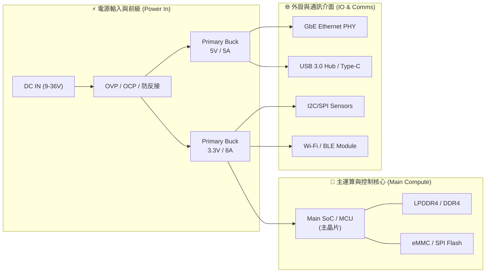

# 🏛️ <% tp.file.title %> 硬體系統架構與電源樹規劃

> [!ABSTRACT] ⚡ 30 秒架構速讀 (Executive Summary / TL;DR)
> - 🎯 **系統定位與核心平台**：`main_soc_mcu` | **專案階段**：`project` (`board_rev`)
> - ⚡ **總功率預算與輸入規格**：`input_voltage_range` $\rightarrow$ 總功耗上限 **`total_power_budget_w`**
> - ⏱️ **電源上電架構**：多級分階供電 (Multi-Stage Rails)，滿足各軌時序與單調上升 (Monotonic Rise) 約束
> - 🌐 **匯流排架構**：主控透過 I2C/SPI/PCIe/USB/UART 拓撲串接外設與感測器
> - 👤 **主架構師**：`lead_architect` | **架構狀態**：`status`

---

## 1. 🏛️ 系統頂層方塊圖與模組拓撲 (System Block Diagram & Topology)

### 1.1 頂層硬體架構圖 (Hardware Block Diagram)



### 1.2 核心子系統與介面定義表
| 子系統名稱 | 核心主晶片 / 元器件 | 供電軌 (Power Rails) | 介面協議 (Protocol) | 傳輸速率 / 頻寬 | 備註與隔離要求 |
| :--- | :--- | :--- | :--- | :--- | :--- |
| **主控運算** | `main_soc_mcu` | $0.8\text{V Core}, 1.8\text{V}, 3.3\text{V IO}$ | Memory Bus / System | 1.8 GHz Core | 核心供電紋波 $< 20\text{mV}$ |
| **通訊子系統** | Realtek RTL8211FS | $3.3\text{V}, 1.1\text{V Core}$ | RGMII / SGMII | 1000 Mbps | 差分對長度匹配 $\le 5\,\text{mil}$ |
| **感測子系統** | 溫濕度 / IMU / 電流監測 | $3.3\text{V Sens}$ | I2C (Fast Mode+) | 1.0 MHz | 具備獨立 LDO 隔離濾波 |
| **人機介面** | Type-C / Debug UART | $5.0\text{V VBUS}, 3.3\text{V}$ | USB 3.0 / UART | 5 Gbps / 115200 | 配置 ESD 防護陣列 |

---

## 2. ⚡ 電源樹分級架構與電力預算 (Power Tree & Power Budget Analysis)

### 2.1 電源樹分級拓撲圖 (Power Tree Diagram)

```text
DC IN (9~36V)
  │
  ├──► [TVS + 理想二極體防反接] ──► VBUS_SYS (12V)
         │
         ├──► [Buck 1: LM5145] ──► 5V0_SYS (5.0V / 5.0A, 25.0W) ──► Type-C VBUS / 周邊
         │
         ├──► [Buck 2: TPS548D22] ──► 3V3_SYS (3.3V / 8.0A, 26.4W)
         │       │
         │       ├──► 3V3_DIGITAL (MCU, Flash, I/O)
         │       └──► [LDO 1: TPS7A4700] ──► 3V3_ANALOG (3.3V / 500mA, 低噪訊 ADC 基準)
         │
         └──► [Buck 3: TPS54302] ──► 1V8_SYS (1.8V / 3.0A, 5.4W)
                 │
                 └──► [Buck 4: Multi-phase PMIC] ──► 0V85_VDD_CORE (0.85V / 12.0A, 10.2W)
```

### 2.2 各電源軌規格、效率與熱損耗計算表
| 電源軌名稱 | 輸入來源 | 轉換拓撲 / 晶片選型 | 輸出電壓 ($V$) | 最大負載 ($I_{MAX}$) | 紋波容限 ($V_{pk-pk}$) | 預估效率 ($\eta$) | 晶片功耗 ($P_{loss}$) | 降額狀態 ($\le 60\%$) |
| :--- | :--- | :--- | :---: | :---: | :---: | :---: | :---: | :---: |
| **5V0_SYS** | VBUS_SYS (12V) | Buck / TI LM5145 | $5.0\text{ V}$ | $3.5\text{ A}$ (額定 5A) | $< 30\text{ mV}$ | $92.5\%$ | $1.42\text{ W}$ | 🟢 $70.0\%$ (需散熱) |
| **3V3_SYS** | VBUS_SYS (12V) | Buck / TI TPS548D22 | $3.3\text{ V}$ | $4.8\text{ A}$ (額定 8A) | $< 25\text{ mV}$ | $90.2\%$ | $1.72\text{ W}$ | 🟢 $60.0\%$ |
| **1V8_SYS** | 3V3_SYS (3.3V) | Buck / TI TPS54302 | $1.8\text{ V}$ | $1.5\text{ A}$ (額定 3A) | $< 20\text{ mV}$ | $88.0\%$ | $0.37\text{ W}$ | 🟢 $50.0\%$ |
| **0V85_CORE**| 5V0_SYS (5.0V) | Buck / TI TPS56C215 | $0.85\text{ V}$ | $8.0\text{ A}$ (額定 12A) | $< 15\text{ mV}$ | $86.5\%$ | $1.06\text{ W}$ | 🟢 $66.7\%$ |
| **3V3_ANA** | 3V3_SYS (3.3V) | LDO / TI TPS7A4700 | $3.3\text{ V}$ | $0.2\text{ A}$ (額定 0.5A)| $< 5\,\mu\text{V}_{rms}$| -- | $0.15\text{ W}$ | 🟢 $40.0\%$ |

### 2.3 總功耗預算與散熱平衡 (Thermal Balance)
- **系統最大輸入功率**：$P_{IN\_MAX} = 22.8\text{ W}$（在 $V_{IN} = 12\text{V}$ 時，$I_{IN} \approx 1.9\text{A}$）
- **板上總熱耗散 (Total Heat Dissipation)**：$P_{TOTAL\_LOSS} = \sum P_{loss} \approx 4.72\text{ W}$
- **散熱措施**：主 DC-DC 區域底層鋪滿銅箔接地，配置 $4\times 4$ 陣列散熱過孔，結溫預估 $T_J \le 85^\circ\text{C}$（滿足 $T_J \le 105^\circ\text{C}$ 審查規範）。

---

## 3. ⏱️ 上電與關機時序約束 (Power-On / Power-Down Sequencing & Reset)

### 3.1 上電時序圖 (Power-Up Timing Sequence)

```text
VIN (12V)       ───┐_____________________________________________________________
                   │ <-- t1 (2ms)
3V3_SYS         ───┴──────────┐__________________________________________________
                              │ <-- t2 (1.5ms)
1V8_SYS         ──────────────┴──────────┐_______________________________________
                                         │ <-- t3 (1ms)
0V85_CORE       ─────────────────────────┴──────────┐____________________________
                                                    │ <-- t4 (10ms, PG High)
SYS_RESET_N     ────────────────────────────────────┴────────────────────────────
```

### 3.2 時序控制機制與延遲參數表
| 階段序號 | 觸發信號 / 電源軌 | 啟動條件 / 延遲依據 | 規格要求時間 ($\Delta t$) | 實現方式 (Hardware / CPLD) |
| :---: | :--- | :--- | :---: | :--- |
| **Seq 1** | $V_{IN} \rightarrow 3\text{V3\_SYS}$ | UVLO 判定合格，EN 由電阻分壓拉高 | $t_1 \ge 2.0\text{ ms}$ | RC 軟啟動電容 ($C_{SS} = 10\text{nF}$) |
| **Seq 2** | $3\text{V3\_SYS} \rightarrow 1\text{V8\_SYS}$ | 3V3 PGOOD 觸發 1V8 之 EN 引腳 | $1.0\text{ ms} \le t_2 \le 5.0\text{ ms}$ | 硬體 PGOOD 直連 EN |
| **Seq 3** | $1\text{V8\_SYS} \rightarrow 0\text{V85\_CORE}$| 1V8 PGOOD 觸發 Core PMIC EN | $0.5\text{ ms} \le t_3 \le 2.0\text{ ms}$ | 硬體 PGOOD 直連 EN |
| **Seq 4** | 釋放 `SYS_RESET_N` | 所有電源軌 PGOOD 均為 High 且時鐘穩定 | $t_4 \ge 10.0\text{ ms}$ | 專用 Reset 晶片 (TPS3823) 延時釋放 |

### 3.3 異常掉電防護與欠壓保護 (Brown-out & Power-Down)
- **欠壓鎖定 (UVLO)**：$V_{IN} < 8.2\text{ V}$ 時硬體關斷所有輸出，防止 DC-DC 進入大電流飽和區。
- **掉電順序 (Power-Down)**：嚴格遵循 $V_{CORE} \rightarrow V_{1V8} \rightarrow V_{3V3}$ 逆向釋放，防止 I/O 倒灌電壓導致主晶片內部保護二極體閂鎖 (Latch-up)。

---

## 4. 🌐 跨晶片通訊匯流排拓撲與位址映射 (Inter-Chip Bus Topology & Address Map)

### 4.1 I2C / SMBus 匯流排分配與 7-bit 地址表
| 匯流排名稱 | 速率 (Speed) | 上拉電阻 ($R_{PU}$) | 掛載設備名稱 | 7-bit 實體位址 (Hex) | 警報中斷引腳 (IRQ) |
| :--- | :---: | :---: | :--- | :---: | :--- |
| **I2C1_SYS** | 400 kHz | $2.2\,\text{k}\Omega$ | EEPROM (AT24C64) | `0x50` | -- |
| **I2C1_SYS** | 400 kHz | 共享 $2.2\,\text{k}\Omega$ | 溫濕度感測器 (SHT40) | `0x44` | `ALERT_TEMP_N` (GPIO1_4) |
| **I2C1_SYS** | 400 kHz | 共享 $2.2\,\text{k}\Omega$ | 電源電流監測 (INA226) | `0x40` | `ALERT_INA_N` (GPIO1_5) |
| **I2C2_PMIC**| 1.0 MHz | $1.5\,\text{k}\Omega$ | 主核心動態調壓 PMIC | `0x60` | `PMIC_INT_N` (EXTI0) |

### 4.2 SPI / QSPI 晶片選擇 (CS) 與極性分配表
| SPI 匯流排 | 時鐘頻率 ($f_{SCK}$) | SPI Mode (CPOL/CPHA) | 片選信號 (CS) | 掛載設備 | 備註 |
| :--- | :---: | :---: | :--- | :--- | :--- |
| **QSPI0** | 100 MHz | Mode 0 (0, 0) | `QSPI_CS0_N` | 64MB NOR Flash (開機固件) | 支援 Quad I/O 模式 |
| **SPI1** | 20 MHz | Mode 3 (1, 1) | `SPI1_CS_IMU` | 6 軸 IMU (BMI270) | 差分走線長度嚴格對稱 |
| **SPI1** | 20 MHz | Mode 0 (0, 0) | `SPI1_CS_ADC` | 8 通道 16-bit ADC | 模擬區獨立隔離地 |

---

## 5. 🛡️ 首席架構師硬體邊界與降額審查 (Architect Derating & Review)

> [!TIP] 🔬 硬體架構審查檢核 (Tri-Stack EE Standards)
> - [x] **輸入防護**：配置雙向 TVS 吸收 $\pm 2\text{kV}$ 浪湧，具備理想二極體防反接。
> - [x] **最壞情況降額**：所有開關電晶體耐壓降額 $\le 75\%$，負載電流熱降額 $\le 60\%$。
> - [x] **結溫評估**：在環境最高溫 $85^\circ\text{C}$ 下，計算全板最熱晶片結溫 $T_J = 98.4^\circ\text{C} \le 105^\circ\text{C}$。
> - [x] **時鐘與復位**：所有主時鐘晶振配置對稱地包覆，Reset 引腳配置 $100\text{nF}$ 濾波防誤觸發。

---

## 6. 📚 關聯專案、晶片選型與設計文件 (Related Specs & References)

- **所屬研發專案 (Project)**：
  - `[[10_Projects/2026-新一代邊緣計算主板研發專案]]`
- **核心晶片選型卡 (Component Specs)**：
  - `[[30_Resources/02_Permanent/Hardware/Components/TI_TPS548D22_Buck]]`
  - `[[30_Resources/02_Permanent/Hardware/Components/TI_TPS7A4700_LDO]]`
- **PCB 疊構與走線規格 (PCB Stackup)**：
  - `[[30_Resources/02_Permanent/Hardware/PCB/8層高速運算主板疊構與阻抗規格]]`
- **對應韌體架構規格 (FW Architecture)**：
  - `[[30_Resources/02_Permanent/Firmware/RTOS/邊緣運算核心RTOS任務與驅動規格]]`
