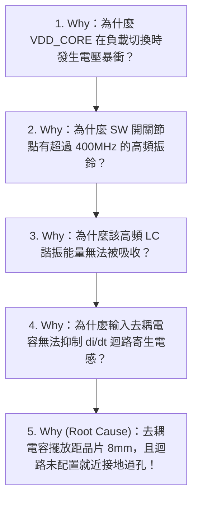

# 🔬 Debug - <% tp.file.title.replace('Debug - ', '') %>

> [!ABSTRACT] ⚡ 30 秒決策速讀 (Executive Summary / TL;DR)
> - 🎯 **問題現象**：
> - 🔍 **根本原因 (Root Cause)**：
> - 🛠️ **臨時處置 (Workaround)**：
> - 🏁 **改版狀態 (ECO Status)**：`status` | **預定導入版本**：`board_rev` (ECO: `eco_number`)
> - 📌 **專案看板**：`project` (板號: `board_sn` | 嚴重度: `severity` | 領域: `issue_type`)

---

## 1. 🚨 問題現象與重現剖析 (Symptom & Reproduction Profile)

### 1.1 異常現象詳述
- **故障表現**：
- **影響範圍與卡關風險**（Blocker 評估）：
  - [ ] 阻礙板卡點亮 (Bring-up)
  - [ ] 導致系統不定期重啟 / 藍屏 / 當機
  - [ ] 通訊封包遺失 (Bit Error / CRC Error)
  - [ ] 量測參數超標 (超出規格容限)

### 1.2 觸發環境與操作條件
- **輸入電壓與負載**：$V_{IN} = \quad \text{V}$, $I_{LOAD} = \quad \text{A}$（輕載 / 滿載 / 動態跳載）
- **環境條件**：常溫 $25^\circ\text{C}$ / 高低溫箱 ($^\circ\text{C}$) / 濕度 ($\%$)
- **重現率 (Reproduction Rate)**：100% / 偶發（約 $\quad$ 次出現 1 次）
- **特定觸發 Pattern / 韌體操作**：

---

## 2. 🔬 測試配置與量測保真度檢核 (Test Setup & Probing Fidelity)

> [!TIP] 💡 硬體量測防呆原則
> 嚴禁使用長接地鱷魚夾進行高頻或電源漣波量測，避免天線效應導入空間噪訊造成誤判。

### 2.1 量測環境與儀器配置清單
| 項目 | 設備 / 參數配置 | 檢驗標準 / 備註 |
| :--- | :--- | :--- |
| **待測板 (DUT)** | S/N: `board_sn` / FW: `fw_ver` | 確認板上無其他未受控的臨時飛線 |
| **主要儀器** | 示波器型號：`instruments` | 頻寬 $\ge 4\times$ 待測信號最高頻率 |
| **探棒類型** | 10:1 被動探棒 / 50Ω 主動差分探棒 | 探棒負載效應已評估 |
| **探棒接地手法** | [ ] 接地彈簧 (Ground Spring) [ ] 同軸電纜直接焊接 (Pigtail Solder) [ ] 差分探頭焊線 | ❌ 嚴禁長鱷魚夾地線 |
| **通道濾波與耦合**| 頻寬限制：[ ] 20MHz (Ripple專用) / [ ] 全頻寬 耦合方式：[ ] AC / [ ] DC 1MΩ / [ ] DC 50Ω | 避免直流偏置拉低靈敏度 |

### 2.2 測試點位與參考基準 (Test Points & Ground Reference)
- 📍 **TP1 (Signal Node)**：`TP_VDD_CORE` (IC Pin 4)
- 📍 **GND1 (Clean Reference Ground)**：`TP_GND_QUIET` (鄰近去耦電容地焊盤)
- 📍 **TP2 (Switching / Trigger Node)**：`TP_SW_NODE` (作為示波器 CH2 觸發源)

---

## 3. 📊 量測波形對照與實驗數據 (Waveforms & Measurements Comparison)

### 3.1 異常 (Fail) vs 修復後 (Pass) 波形對照

> [!FAILURE] 🔴 異常波形 (Before / Fail Baseline)
> ![[90_System/Attachments/波形截圖_異常_Fail.png]]
> *波形描述：開關節點產生劇烈震鈴，過沖電壓達 1.85V，超出 IC 絕對最大額定值 (AMR)。*

> [!SUCCESS] 🟢 驗證修復波形 (After / Pass Verified)
> ![[90_System/Attachments/波形截圖_修復後_Pass.png]]
> *波形描述：加入 RC Snubber 與改善去耦迴路後，過沖壓降至 1.18V，振鈴完全在 2 個週期內衰減。*

### 3.2 實測數值與規範裕度對比表 (Measured vs Spec)

| 測試項目 (Parameter) | 規範標準 (Spec Limit) | 實測數值 (Measured) | 裕度 (Margin) | 判定 (Pass/Fail) | 測試條件與說明 |
| :--- | :---: | :---: | :---: | :---: | :--- |
| **電源漣波 (Ripple pk-pk)** | $< 30\text{ mV}$ | $18\text{ mV}$ | $+40.0\%$ | 🟢 Pass | $I_{OUT}=5\text{A}, \text{BW}=20\text{MHz}$ |
| **開關節點過沖 ($V_{SW\_MAX}$)** | $< 1.35\text{ V}$ | $1.18\text{ V}$ | $+12.6\%$ | 🟢 Pass | 滿載 $V_{IN}=12\text{V}$, 全頻寬 |
| **上升時間 (Rise Time)** | $< 1.2\text{ ns}$ | $0.92\text{ ns}$ | $+23.3\%$ | 🟢 Pass | 10% ~ 90% 區間 |
| **差分眼高 (Eye Height)** | $> 120\text{ mV}$ | $162\text{ mV}$ | $+35.0\%$ | 🟢 Pass | PRBS-31, BER $\le 10^{-12}$ |

---

## 4. 🔍 5-Whys 根因分析與物理機制 (5-Whys RCA & Circuit Physics)

### 4.1 5-Whys 根本原因推導因果鏈 (5-Whys Chain)

1. **Why 1 (現象層)**：
2. **Why 2 (電路層)**：
3. **Why 3 (佈局/元件層)**：
4. **Why 4 (規範/流程層)**：
5. **Why 5 (根本原因 True Root Cause)**：

### 4.2 底層物理與電路機制解析 (Circuit Physics & Formulas)
- **核心機制公式**：
  $$V_{spike} = L_{parasitic} \cdot \frac{di}{dt}$$
  $$f_{ringing} = \frac{1}{2\pi \sqrt{L_{loop} \cdot C_{oss}}}$$
- **機制推導與理論驗證**：

---

## 5. 🛠️ 臨時對策與改板飛線驗證 (Workaround & Board Rework)

> [!NOTE] 🔧 當前測試板 Rework 施工步驟
> 1. [ ] **割線 / 拆件**：移除原板上 $C_{12}$ (0805 封裝，位置不佳)
> 2. [ ] **死蟲 / 刮銅飛線**：在 IC 第 3 腳 ($V_{IN}$) 與第 6 腳 (PGND) 引腳頂端直接死蟲焊接 0402 0.1$\mu$F 高頻去耦電容
> 3. [ ] **阻尼 Snubber 增設**：於 SW Node 對地串接 $R_{snub} = 2.2\,\Omega + C_{snub} = 470\,\text{pF}$

### 5.1 ⚠️ 副作用與邊際效應評估 (Side Effect & Margin Risk)
- [ ] **熱效應與溫度變化**：加入 Snubber / 修改驅動後，IC 表面溫度自 $\quad ^\circ\text{C} \rightarrow \quad ^\circ\text{C}$（符合 $T_J \le 105^\circ\text{C}$ 降額規範）
- [ ] **暫態響應與環路穩定度**：負載跳階（Step Response）過沖與下衝均在 $\pm 5\%$ 內，相位裕度 $\text{PM} \ge 55^\circ$
- [ ] **啟動衝擊電流 (Inrush Current)**：無異常電流尖峰，未觸發 OCP 過流保護

---

## 6. 🏁 長期改版方案與 ECO 實施 (Permanent Fix & ECO / Next Rev)

### 6.1 改版變更清單 (ECO Action Items)
- [ ] 📝 **Schematic (電路圖變更)**：
  - 增設預留 Snubber 電路封裝 ($R_{snub}, C_{snub}$)
  - 調整反饋電阻分壓比與 COMP 環路補償參數
- [ ] 📐 **PCB Layout (佈線與疊構變更)**：
  - 將 $C_{IN}$ 電容緊貼 IC 引腳，縮減高 $di/dt$ 迴路面積 $< 15\,\text{mm}^2$
  - SW Node 鋪銅最小化，內層走線由完整地平面 (GND Plane) 完整包覆屏蔽
  - 換層過孔兩側打滿 Ground Stitching Vias
- [ ] 📦 **BOM 料號變更**：
  - 替換輸出電容為低 ESR 陶瓷電容 (X7R 規格)

### 6.2 變更單號與版本追蹤
- **ECO 追蹤單號**：`eco_number`
- **預計導入硬體版本**：`board_rev` (如 DVT Rev B)
- **驗證負責人**：

---

## 7. 🛡️ 團隊設計防禦與規範回饋 (Design Rule & Checklist Feedback Loop)

> [!IMPORTANT] 🔁 閉環反饋機制
> 將本次除錯經驗轉化為團隊的自動防禦機制，防止相同問題在下一個專案重現。

- [ ] 📋 **《硬體設計審查 Check List》更新**：
  - [ ] 新增檢查項：*「所有 Buck/Boost 晶片之輸入去耦電容與 IC 引腳距離必須 $\le 2\,\text{mm}$」*
- [ ] 📏 **EDA / DRC Constraint 規則庫更新**：
  - [ ] 設定高壓開關節點與敏感類比信號 (FB/COMP) 之最小間距約束 $\ge 20\,\text{mil}$
- [ ] 🧪 **產線與實驗室測試 SOP 補強**：
  - [ ] 將本測試項目納入 EVT/DVT 標準自動化測試測項 (ATE/Python Test Script)

---

## 8. 💎 沉澱為通用硬體原子卡片 (Permanent Notes Distilled)

- 知識沈澱關聯（提煉自本次除錯之通用工程原理）：
  - `[[30_Resources/02_Permanent/Hardware/Power/降壓轉換器開關節點振鈴抑制與Snubber計算]]`
  - `[[30_Resources/02_Permanent/Hardware/SIPI/高di_dt開關迴路寄生電感控制準則]]`
  - `[[30_Resources/02_Permanent/Hardware/Components/陶瓷電容直流偏壓特性與降額分析]]`
