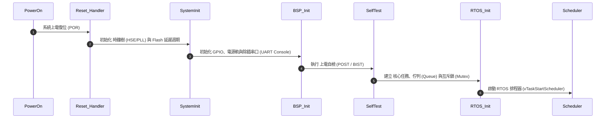
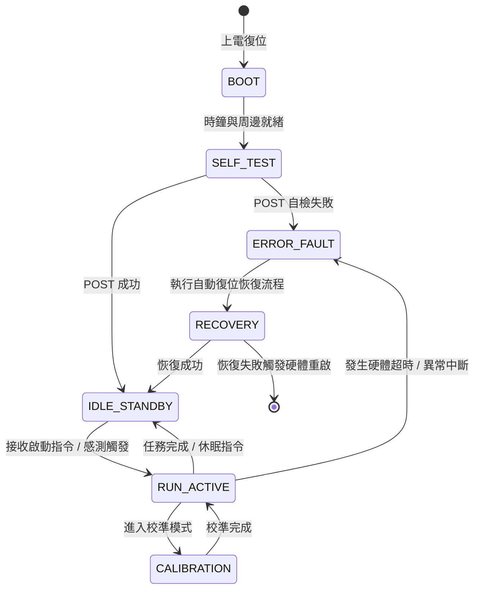

# ⚡ <% tp.file.title %> 韌體架構與 RTOS 規格

> [!ABSTRACT] ⚡ 30 秒架構速讀 (Architecture Snapshot / TL;DR)
> - 🎯 **目標平台**：`target_mcu` (`system_clock_mhz`) ｜ **RTOS 核心**：`rtos_kernel` (Tick: `tick_rate_hz`)
> - 📊 **資源配置**：RAM `total_sram_kb` KB ｜ **核心架構師**：`lead_architect` ｜ **專案**：`project`
> - 🔄 **架構模式**：事件驅動有限狀態機 (FSM) + 優先級搶佔式多任務排程 (Preemptive Priority Scheduling)
> - 💡 **核心職責**：一句話描述本韌體系統負責之即時控制、數據採集與通訊路由任務。

---

## 1. ⚙️ 時鐘樹配置與啟動時序 (Clock Tree & Power-on Sequence)

### 1.1 系統時鐘配置 (Clock Configuration)
- **主時鐘源 (Clock Source)**：外部無源晶振 (HSE 25MHz) 經 PLL 倍頻至 `system_clock_mhz`
- **低速時鐘 (LSE/LSI)**：$32.768\,\text{kHz}$ RTC 與獨立看門狗 (IWDG)
- **匯流排時鐘分頻**：
  - $\text{AHB} = 240\,\text{MHz}, \text{APB1} = 120\,\text{MHz}, \text{APB2} = 120\,\text{MHz}$

### 1.2 系統開機初始化時序 (Boot & Power-on Sequencing)

---

## 2. 🔄 系統有限狀態機 (System Finite State Machine - FSM)

---

## 3. ⏱️ RTOS 任務劃分與資源預算表 (Task Allocation & Stack Budget)

> [!TIP] 💡 任務優先級與堆疊防爆原則
> 數值越小代表優先級越低（FreeRTOS 規則）。高頻即時採樣任務設定最高優先級；網路通訊與背景任務設定較低優先級。

| 任務名稱 (Task Name) | 優先級 (Priority) | 週期 / 觸發源 | 堆疊大小 (Stack Size) | 核心職責與執行時間 ($T_{exec}$) | 堆疊水位警告 |
| :--- | :---: | :---: | :---: | :--- | :---: |
| **`task_critical_ctrl`** | 5 (最高) | $1\,\text{ms}$ (Timer) | 512 Words (2KB) | 閉迴路 PID 控制演算 ($T_{exec} \le 120\,\mu\text{s}$) | $< 80\%$ |
| **`task_sensor_sample`** | 4 | $10\,\text{ms}$ (Interrupt) | 1024 Words (4KB) | I2C/SPI 感測器 DMA 數據讀取與濾波 | $< 70\%$ |
| **`task_protocol_comm`** | 3 | Event Driven | 2048 Words (8KB) | 解析 UART/CAN 封包並組裝回傳幀 | $< 75\%$ |
| **`task_storage_nvm`** | 2 | $100\,\text{ms}$ | 1024 Words (4KB) | Flash / EEPROM 日誌參數存檔 | $< 60\%$ |
| **`task_housekeeping`** | 1 (最低) | $500\,\text{ms}$ | 512 Words (2KB) | 餵看門狗、LED 心跳、CPU 使用率統計 | $< 50\%$ |

---

## 4. 🔀 任務間通訊與同步機制 (IPC & Synchronization)

| IPC 資源名稱 | 類型 (Type) | 深度 / 屬性 | 數據傳遞方向 (From $\rightarrow$ To) | 臨界區保護措施 |
| :--- | :---: | :---: | :---: | :--- |
| **`q_sensor_data`** | FreeRTOS Queue | 16 筆結構體 | `task_sensor` $\rightarrow$ `task_protocol` | 零拷貝傳遞指標 |
| **`mtx_i2c_bus`** | Mutex (Priority Inheritance) | 遞歸互斥鎖 | 多任務共用 I2C 匯流排 | 啟用優先級繼承防優先級反轉 |
| **`sem_dma_complete`** | Binary Semaphore | 中斷同步 | `DMA1_ISR` $\rightarrow$ `task_sensor` | 於 ISR 使用 `FromISR` API |
| **`eg_system_events`** | Event Group | 24-bit 標誌位 | 全域事件廣播 (如斷電預警、連線成功) | 非阻塞檢查 |

---

## 5. ⚡ 中斷 (ISR)、優先級分組與延遲處理 (NVIC & Interrupt Latency)

### 5.1 中斷優先級分組 (NVIC Priority Grouping)
- **NVIC 分組**：`NVIC_PRIORITYGROUP_4`（4 bits 全部用於搶佔優先級 Preemption Priority，0 bits 子優先級）
- **FreeRTOS API 允許最大中斷優先級**：`configMAX_SYSCALL_INTERRUPT_PRIORITY = 5`（優先級 0~4 嚴禁調用 FreeRTOS API）

| 中斷名稱 (IRQ) | 搶佔優先級 | 觸發頻率 | 處理策略 (Handling Strategy) |
| :--- | :---: | :---: | :--- |
| **`DMA1_Stream0_IRQ`** | 5 | $100\,\text{Hz}$ | **頂半部 (Top-Half)**：清除標誌位，釋放信號量；不作任何耗時運算 |
| **`EXTI0_IRQ (DRDY)`** | 6 | 異步突發 | 通知感測任務啟動 DMA 傳輸 |
| **`USART1_IRQ`** | 7 | 異步 | 寫入環形緩衝區 (Ring Buffer) |

---

## 6. 🛡️ 系統健康監控與看門狗策略 (Watchdogs & Diagnostics)

> [!CAUTION] 🚨 嵌入式多任務防死鎖與看門狗機制
> 嚴禁在單一低優先級任務中獨立餵狗！必須採用**「多任務心跳確認機制 (Task Checkin Register)」**。

1. **獨立看門狗 (IWDG)**：超時時間設定為 $1000\,\text{ms}$。
2. **多任務餵狗機制**：
   - 定義 32-bit 位元掩碼 `g_task_checkin_flags`。
   - 每個關鍵任務在正常循環結束時設置自己的標誌位。
   - `task_housekeeping` 檢查所有關鍵標誌位皆為 1 時才執行硬體餵狗，並清零掩碼。
3. **HardFault 崩潰診斷機制**：
   - 註冊自訂 `HardFault_Handler`，崩潰時將 `R0-R3, R12, LR, PC, PSR` 暫存器內容寫入 Backup SRAM 或 Flash 事故黑匣子。

---

## 7. 🧪 效能剖析與壓力測試 (Performance & CPU Budget)

- [ ] **CPU 負載率驗證**：滿載工作時總 CPU Load $\le 65\%$（預留 $35\%$ 裕度應對突發中斷）
- [ ] **堆疊高水位監控 (Stack High-Watermark)**：啟用 `INCLUDE_uxTaskGetStackHighWaterMark = 1`，確認每任務至少有 128 Words 裕度
- [ ] **中斷延遲時間 (Interrupt Latency)**：實測最長中斷禁用時間 $\le 15\,\mu\text{s}$

---

## 8. 📚 關聯驅動、協議與專案
- **關聯晶片驅動**：`[[Template - Firmware Driver Spec]]`
- **通訊協議規範**：`[[Template - Firmware Protocol & Packet Spec]]`
- **引導與升級規格**：`[[Template - Firmware Bootloader & OTA Spec]]`
