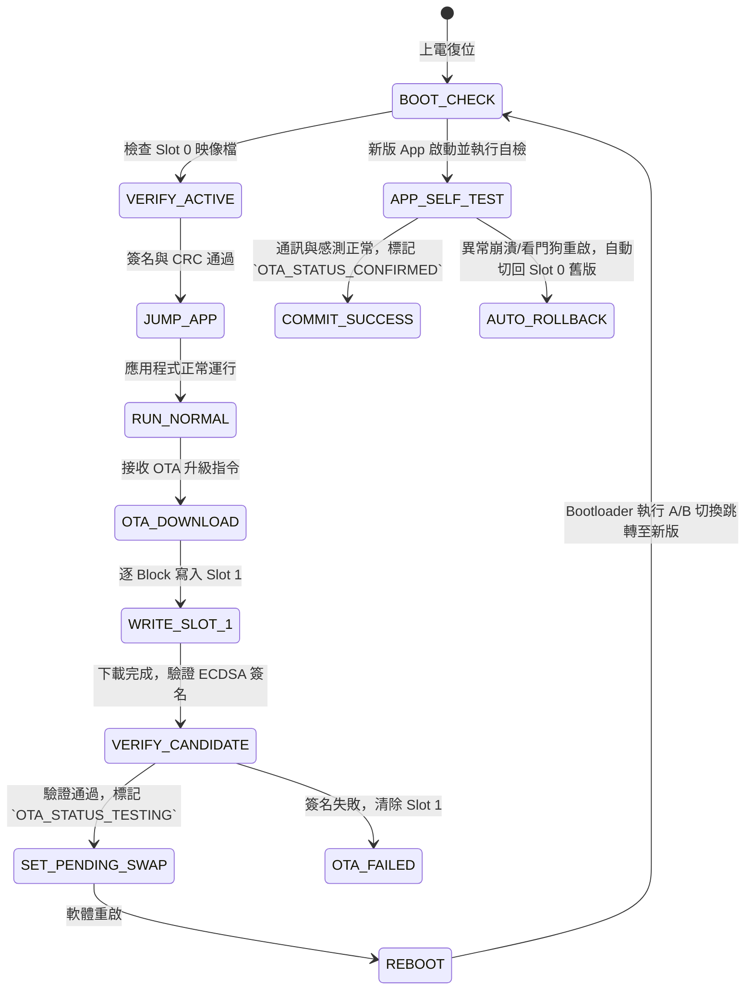

# 🛡️ <% tp.file.title %> 引導與 OTA 升級規格

> [!ABSTRACT] ⚡ 30 秒 OTA 速讀 (OTA Snapshot / TL;DR)
> - 🎯 **目標 MCU**：`target_mcu` ｜ **升級架構**：`ota_strategy`
> - 🔒 **安全簽名**：`signature_algorithm` ｜ **防回滾版本**：`anti_rollback_version` ｜ **App 容量上限**：`max_app_size_kb`
> - 🛡️ **防磚機制**：雙分區 A/B 無縫熱切換 + 自檢確認 (Self-Test Commit) + 失敗自動回滾舊版
> - 📌 **專案**：`project` ｜ **狀態**：`status`

---

## 1. 🗺️ Flash 記憶體分區地圖 (Flash Memory Map & Partition Table)

### 1.1 空間佈局長條圖 (Memory Layout Visualization)
```text
 +-----------------------------------+ 0x0807_FFFF
 |        NVM_CONFIG (32 KB)         |  (系統校準參數、OTA 狀態標籤與安全計數器)
 +-----------------------------------+ 0x0807_8000
 |       APP_SLOT_1 (224 KB)         |  (OTA 下載候選暫存區 / Bank 2 Candidate)
 +-----------------------------------+ 0x0804_0000
 |       APP_SLOT_0 (224 KB)         |  (主應用程式運行區 / Bank 1 Active Exec)
 +-----------------------------------+ 0x0800_8000
 |        BOOTLOADER (32 KB)         |  (引導程式、ECDSA 簽名驗簽與跳轉程序)
 +-----------------------------------+ 0x0800_0000
```

### 1.2 分區規格詳細表 (Partition Table)
| 分區名稱 (Partition) | 起始位址 (Start Addr) | 結束位址 (End Addr) | 容量大小 (Size) | 磁區屬性 (Attributes) | 用途與說明 |
| :--- | :---: | :---: | :---: | :---: | :--- |
| **`BOOTLOADER`** | `0x0800_0000` | `0x0800_7FFF` | 32 KB | Read-Only (Write Protect) | 引導程式、簽名驗證與硬體跳轉 |
| **`APP_SLOT_0` (Active)** | `0x0800_8000` | `0x0803_FFFF` | 224 KB | Executable | 當前正在運行的主要應用程式 (Bank 1) |
| **`APP_SLOT_1` (Candidate)**| `0x0804_0000` | `0x0807_7FFF` | 224 KB | Read/Write | 待驗證或新下載的 OTA 韌體暫存 (Bank 2) |
| **`NVM_CONFIG_DATA`** | `0x0807_8000` | `0x0807_FFFF` | 32 KB | Non-Volatile Data | 系統校準參數、OTA 標誌位與安全計數器 |

---

## 2. 🔄 雙分區 A/B 無縫升級與回滾流程 (A/B Swap & Rollback FSM)



---

## 3. 🔒 安全引導與防回滾機制 (Secure Boot & Anti-Rollback)

### 3.1 映像檔標頭結構 (Firmware Header - 512 Bytes)
```c
typedef struct {
    uint32_t magic;                 // 0x544F4F42 ("BOOT")
    uint32_t image_size;            // 韌體純二進位大小 (Bytes)
    uint32_t version_code;          // 語意版本號 (e.g. 0x020100 -> v2.1.0)
    uint32_t security_counter;      // 防回滾安全計數器 (嚴格 >= 目前硬體計數器)
    uint8_t  sha256_hash[32];       // App 鏡像之 SHA-256 雜湊值
    uint8_t  ecdsa_signature[64];   // R & S 簽名值 (ECDSA P-256)
    uint8_t  reserved[400];         // 預留對齊 512 Bytes
} ota_image_header_t;
```

### 3.2 防回滾驗證規則 (Anti-Rollback Defense)
- Bootloader 內建一次性燒錄安全計數器 (Security Counter in OTP / NVM)。
- 若新韌體的 `security_counter < current_security_counter`，即使簽名完全合法，Bootloader 也將**拒絕升級並立即報警**，徹底杜絕降級攻擊 (Downgrade Attack)。

---

## 4. ⚡ 向量表重定位與跳轉程序 (VTOR Remap & Jump Routine)

```c
void bootloader_jump_to_app(uint32_t app_address) {
    uint32_t app_sp = *(volatile uint32_t*)app_address;
    uint32_t app_entry = *(volatile uint32_t*)(app_address + 4);

    // 1. 關閉所有中斷與 SysTick
    __disable_irq();
    SysTick->CTRL = 0;
    SysTick->LOAD = 0;
    SysTick->VAL  = 0;

    // 2. 重定位中斷向量表 (VTOR)
    SCB->VTOR = app_address;

    // 3. 設置主堆疊指針 (MSP)
    __set_MSP(app_sp);

    // 4. 跳轉進入應用程式 Entry Point
    void (*app_reset_handler)(void) = (void (*)(void))app_entry;
    app_reset_handler();
}
```

---

## 5. 🛡️ 斷電保護與防磚機制 (Power-Loss Recovery & Anti-Brick)

| 潛在故障點 | 防禦設計 (Protection Architecture) |
| :--- | :--- |
| **下載中途斷電** | Slot 1 尚未標記為待驗證狀態，重啟後自動繼續由 Slot 0 舊版啟動 |
| **寫入中途 Flash 損毀** | 雙分區實體隔離，Slot 0 處於寫保護狀態，永遠具備基線恢復能力 |
| **新版 App 無限重啟 (Crash Loop)** | 啟動時啟用看門狗，若未在 30 秒內完成自檢並寫入 `CONFIRMED` 標籤，Bootloader 自動回滾 |

---

## 6. 🧪 驗證與產線測試清單
- [ ] ⚡ **斷電注入測試**：在 Flash 擦除與寫入過程中使用繼電器隨機斷電 100 次，重啟後無死鎖變磚
- [ ] 🔒 **非法簽名拒絕測試**：篡改二進位檔 1 個 Byte，Bootloader 能精確攔截並拒絕跳轉
- [ ] 🔄 **自動回滾測試**：人為注入 HardFault 代碼至新版 App，系統在 3 次重啟後成功回滾舊版
