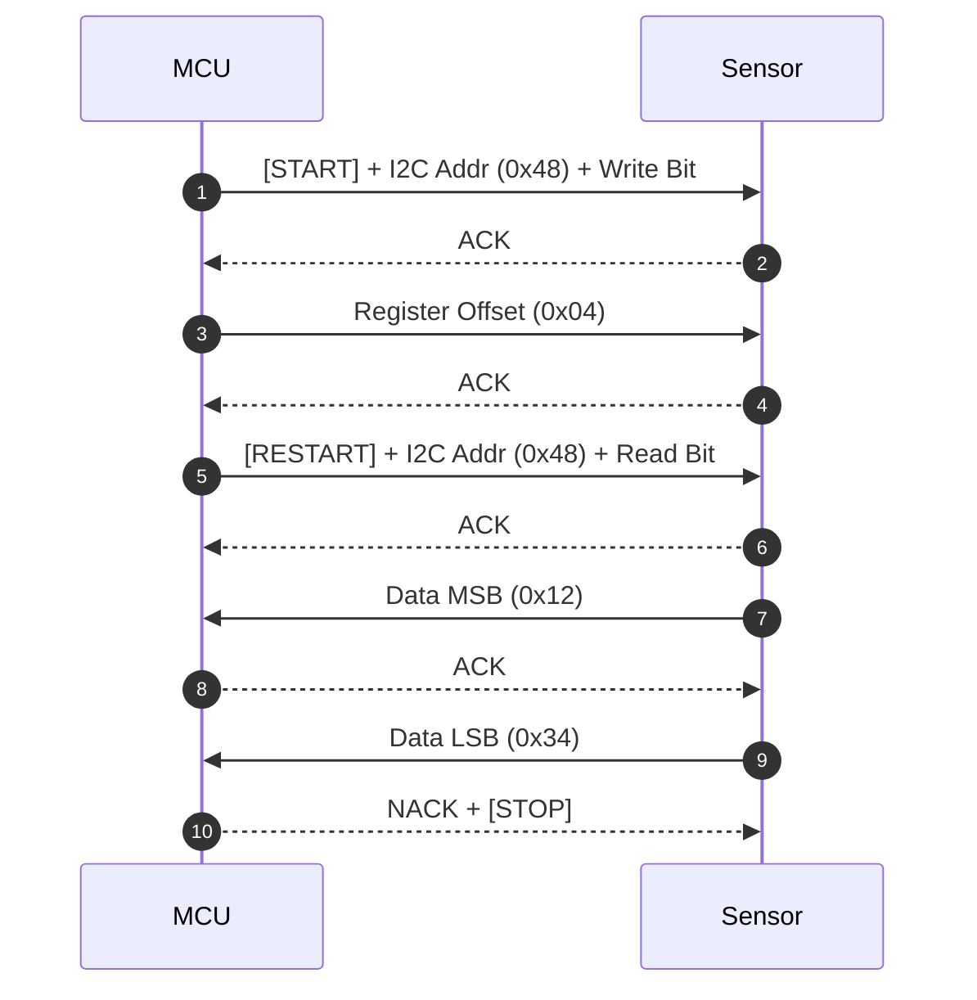

# ⚡ <% tp.file.title %> 驅動規格與 HAL 設計

> [!ABSTRACT] ⚡ 30 秒驅動速讀 (Firmware Driver Snapshot / TL;DR)
> - 🎯 **驅動識別**：`driver_name` ｜ **目標晶片**：`target_chip`
> - 🔌 **匯流排與速率**：`bus_type` (`bus_clock_speed`) ｜ **運行環境**：`os_target`
> - 🛡️ **核心功能**：一句話總結本驅動負責之暫存器配置、數據採樣與中斷事件處理。
> - 📌 **代碼倉庫**：`code_repo` ｜ **狀態**：`status`

---

## 1. ⚙️ 硬體介面與暫存器映射 (Hardware Register Map)

| 偏移位址 (Offset) | 暫存器名稱 (Register) | 位元寬度 | 權限 (R/W) | 預設值 (Reset) | 核心功能與配置說明 |
| :---: | :--- | :---: | :---: | :---: | :--- |
| `0x00` | `REG_CHIP_ID` | 8-bit | RO | `0x54` | 晶片硬體識別碼 (Who-Am-I) |
| `0x01` | `REG_CTRL_CONFIG` | 8-bit | R/W | `0x00` | 採樣率與低功耗模式控制 |
| `0x02` | `REG_STATUS_FLAGS`| 8-bit | R/C | `0x00` | 數據就緒 (DRDY) 與報警中斷標誌 |
| `0x04` | `REG_DATA_OUT_MSB`| 8-bit | RO | `0x00` | 實測高位數據 |

---

## 2. ⏱️ 匯流排協議與傳輸時序 (Bus Protocol & Timing)

### 2.1 匯流排訊號時序 (WaveDrom Timing Diagram)
```wavedrom
{ "signal": [
  { "name": "SCL", "wave": "10.p.......1" },
  { "name": "SDA", "wave": "10.3456789.1", "data": ["A6", "A5", "A4", "A3", "A2", "A1", "A0", "R/W", "ACK"] }
]}
```

### 2.2 協議傳輸時序圖 (Sequence Diagram)


---

## 3. 🔌 驅動核心 API 與 HAL 抽象 (HAL Function Declarations)

```c
/**
 * @brief  初始化感測器並驗證 Chip ID
 * @param  i2c_bus: I2C 匯流排句柄
 * @return 0 成功, 負值代表錯誤碼 (如 -ETIMEDOUT, -ENODEV)
 */
int32_t drv_sensor_init(i2c_bus_t *i2c_bus);

/**
 * @brief  非阻塞讀取實測數據 (支援 DMA/中斷)
 * @param  data: 輸出數據結構體指標
 * @return 0 成功, 負值代表超時或通信失敗
 */
int32_t drv_sensor_read_data(sensor_data_t *data);
```

---

## 4. ⚡ 中斷 (ISR)、DMA 與並發保護 (Interrupts & Concurrency)

> [!TIP] 💡 嵌入式即時性與鎖機制規範
> 1. **中斷下半部 (Bottom-Half / Deferred Processing)**：ISR 僅發送信號量 (Semaphore)，嚴禁在 ISR 內執行阻塞式 I2C/SPI 傳輸！
> 2. **並發互斥鎖 (Mutex)**：多任務存取同一匯流排時，必須透過 Mutex 保護臨界區。

- **中斷引腳 (INT/DRDY Pin)**：配置為下降沿觸發 (Falling Edge Triggered)
- **DMA 緩衝區**：放置於非快取記憶體區 (Non-cacheable SRAM)，防止快取不一致 (Cache Incoherency)。

---

## 5. 🛡️ 硬體防死鎖、超時與看門狗恢復 (Timeout & Deadlock Recovery)

| 異常情境 (Failure Mode) | 防禦與恢復策略 (Recovery SOP) | 超時門檻 (Timeout) |
| :--- | :--- | :---: |
| **I2C 匯流排被拉低鎖死 (Bus Stuck Low)** | 由 GPIO 模擬 9 個 SCL Clock 脈衝解鎖 Slave，隨後發出 STOP | $10\,\text{ms}$ |
| **硬體晶片無響應 (No ACK)** | 執行硬體 RESET 引腳拉低復位，重新執行 `drv_sensor_init()` | $50\,\text{ms}$ |
| **數據溢出或 CRC 錯誤** | 清空 RX FIFO，丟棄損毀封包並記錄錯誤計數 | 即時 |

---

## 6. 🧪 驗證用例與 Logic Analyzer 測試
- [ ] 📈 **Logic Analyzer 抓包確認**：I2C/SPI 時序完全符合晶片手冊 Setup/Hold Time
- [ ] ⚡ **壓力測試**：連續以 $100\,\text{Hz}$ 讀取 24 小時無通訊超時或記憶體洩漏
- [ ] 🔌 **熱插拔/電源波動測試**：瞬間斷電重啟後能自動重新枚舉並正常工作

---

## 7. 📚 關聯硬體晶片規格與專案
- **對應硬體晶片選型卡**：`target_chip`
- **使用此驅動的專案**：`[[10_Projects/2026-新一代邊緣計算主板研發專案]]`
