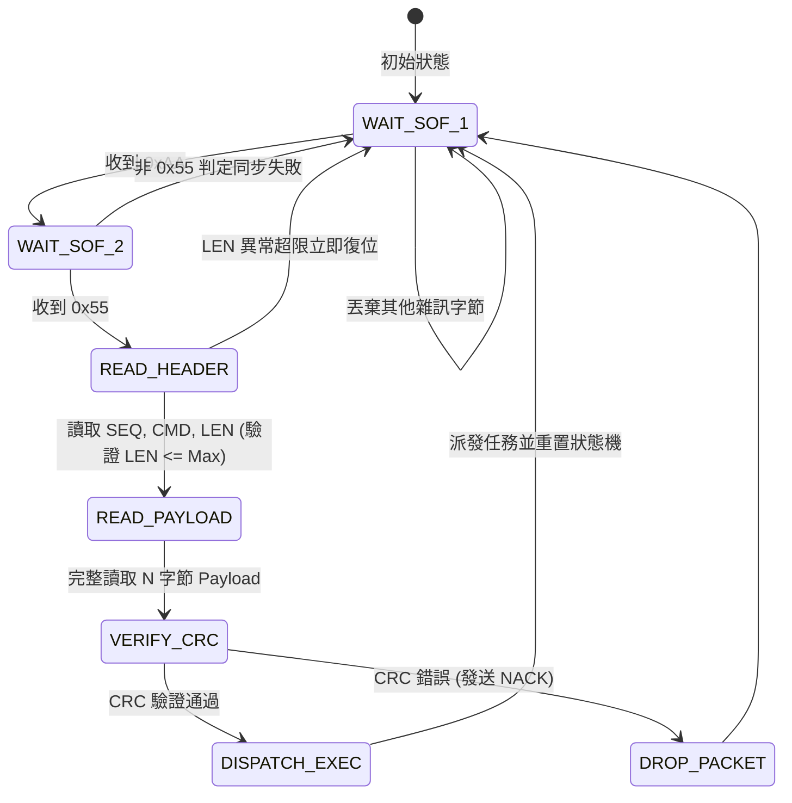

# 📦 <% tp.file.title %> 通訊協議與封包幀規格

> [!ABSTRACT] ⚡ 30 秒協議速讀 (Protocol Snapshot / TL;DR)
> - 🎯 **協議名稱**：`protocol_name` ｜ **實體層**：`physical_layer`
> - 🔢 **幀編碼**：`frame_encoding` ｜ **校驗機制**：`checksum_type` ｜ **最大載荷**：`max_payload_size`
> - 📌 **所屬專案**：`project` ｜ **狀態**：`status`
> - 💡 **協議用途**：一句話定義本協議負責之命令交互、遠端配置或高頻感測數據流傳輸。

---

## 1. 📦 二進位封包幀結構定義 (Binary Frame Layout)

```
 +-------------+-------------+------------+------------+----------------+-------------+
 |  SOF (2B)   |   SEQ (1B)  |  CMD (1B)  |  LEN (2B)  |  PAYLOAD (NB)  |   CRC (2B)  |
 | 0xAA  0x55  |  0x00..0xFF |  Command   | 0x0000..N  |   Data Field   |  CRC-16/CC  |
 +-------------+-------------+------------+------------+----------------+-------------+
```

### 1.1 幀欄位詳細說明 (Field Specifications)
| 欄位名稱 (Field) | 偏移 (Offset) | 長度 (Bytes) | 類型 / 預設值 | 欄位定義與約束 |
| :--- | :---: | :---: | :---: | :--- |
| **SOF (Start of Frame)** | `0x00` | 2 | `0xAA55` | 幀同步起始標頭 (固定值) |
| **SEQ (Sequence ID)** | `0x02` | 1 | `uint8_t` | 封包序號 ($0\sim 255$ 循環累加，用於防丟包重發) |
| **CMD (Command ID)** | `0x03` | 1 | `uint8_t` | 命令類型識別碼 (如 `0x01` 讀取狀態, `0x02` 寫入配置) |
| **LEN (Payload Length)**| `0x04` | 2 | `uint16_t` | 載荷長度 $N$（單位：Bytes，小端序 Little-Endian） |
| **PAYLOAD (Data)** | `0x06` | $N$ | `uint8_t[N]` | 實際傳輸資料（最大 $N = \text{max\_payload\_size}$） |
| **CRC (Checksum)** | $6 + N$ | 2 | `uint16_t` | 自 `SEQ` 至 `PAYLOAD` 結尾之 CRC-16 計算值 |

---

## 2. 📋 命令集與參數對照表 (Command Set & Payload Spec)

| CMD ID | 命令名稱 | 方向 (Dir) | Payload 結構 (Request $\rightarrow$ Response) | 說明與錯誤碼 |
| :---: | :--- | :---: | :--- | :--- |
| `0x01` | **CMD_PING_HEARTBEAT** | $\text{Host} \rightarrow \text{MCU}$ | Req: *None* (0B)<br>Resp: `uint32_t uptime_ms` (4B) | 連結存活檢測心跳 |
| `0x02` | **CMD_GET_SENSOR_RAW** | $\text{Host} \rightarrow \text{MCU}$ | Req: `uint8_t channel_mask` (1B)<br>Resp: `int16_t raw_val[4]` (8B) | 取得 4 軌類比通道採樣原始數據 |
| `0x03` | **CMD_SET_CONFIG_PARAM**| $\text{Host} \rightarrow \text{MCU}$ | Req: `uint16_t param_id, uint32_t val` (6B)<br>Resp: `uint8_t ack_status` (1B) | 參數配置 (0=成功, 1=無效, 2=超範圍) |
| `0x80` | **CMD_ASYNC_ALERT_EVENT**| $\text{MCU} \rightarrow \text{Host}$ | Push: `uint8_t alert_code, uint32_t timestamp` (5B) | 異常報警非同步主動推送 |

---

## 3. 🔄 封包解析狀態機 (Packet Parsing FSM)



---

## 4. ⏱️ 握手時序與超時重傳機制 (Handshake & Retry Policy)

- **請求-應答超時門檻 ($T_{timeout}$)**：$100\,\text{ms}$
- **最大重試次數 ($N_{retry}$)**：$3$ 次
- **重試退避策略**：固定間隔 $50\,\text{ms}$ 重傳，若 3 次皆失敗則向上層拋出 `ERR_COMM_TIMEOUT` 斷線事件。
- **流量控制 (Flow Control)**：當 MCU 緩衝區高於 $80\%$ 水位時，回傳 `ERR_BUSY_FLOW_CTRL`，Host 端暫停發送 $20\,\text{ms}$。

---

## 5. 💻 C 語言封包結構體定義 (C Struct Implementation)

```c
#pragma pack(push, 1)

typedef struct {
    uint16_t sof;       // 0xAA55
    uint8_t  seq;       // 序號
    uint8_t  cmd;       // 命令碼
    uint16_t len;       // 載荷長度
    uint8_t  payload[]; // 彈性陣列成員
} proto_frame_header_t;

typedef struct {
    uint16_t crc;       // CRC-16/CCITT
} proto_frame_footer_t;

#pragma pack(pop)

// CRC-16/CCITT 查表法快速計算
uint16_t crc16_ccitt(const uint8_t *data, size_t length);
```

---

## 6. 🧪 邊界條件與抗干擾測試清單
- [ ] 🔌 **字節錯位與黏包測試**：隨機在封包前插入無效垃圾 Byte，狀態機能精確重新鎖定 0xAA55
- [ ] ⚡ **長度溢出防禦**：發送 `LEN = 0xFFFF` 畸形封包，MCU 能安全攔截並丟棄，不觸發 Buffer Overflow
- [ ] 📊 **通訊速率測試**：連續以 $1000\,\text{幀/秒}$ 傳輸 1 小時，丟包率 $\le 0.001\%$
