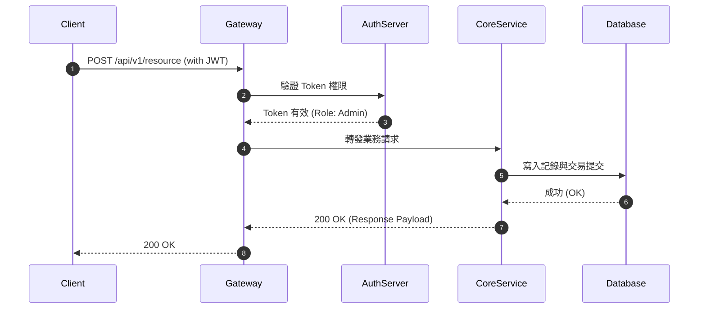

# 🌐 <% tp.file.title %> 介面契約規格

> [!ABSTRACT] ⚡ 30 秒介面速讀 (API Snapshot / TL;DR)
> - 🎯 **端點與方法**：`method` `api_path` ｜ **傳輸協議**：`protocol`
> - 🔒 **身分驗證**：`auth_required` (Bearer JWT / API-Key) ｜ **流控速率**：`rate_limit`
> - 📌 **所屬微服務/專案**：`project` ｜ **維護負責人**：`service_owner` ｜ **狀態**：`status`
> - 💡 **核心功能**：一句話定義本 API 介面的核心職責與業務用途。

---

## 1. 📥 請求參數與 Payload 定義 (Request Schema)

### 1.1 Headers
| 標頭名稱 (Header) | 必填 | 類型 | 範例值 | 說明 |
| :--- | :---: | :---: | :--- | :--- |
| `Authorization` | ✅ | `string` | `Bearer eyJhbGciOi...` | JWT 身分驗證 Token |
| `Content-Type` | ✅ | `string` | `application/json` | 請求內容格式 |

### 1.2 Query Parameters / Path Variables
| 參數名稱 | 必填 | 類型 | 預設值 | 約束與說明 |
| :--- | :---: | :---: | :---: | :--- |
| `page` | ❌ | `integer` | `1` | 頁碼，最小值 $1$ |
| `limit` | ❌ | `integer` | `20` | 每頁筆數，最大值 $100$ |

### 1.3 Request Body (JSON / Protobuf Schema)
```json
{
  "device_id": "DEV-2026-001",
  "temperature": 25.4,
  "status_flag": 1
}
```

---

## 2. 📤 響應結構與狀態碼 (Response Schema & Status Codes)

### 2.1 成功響應 (200 OK / 201 Created)
```json
{
  "code": 200,
  "message": "success",
  "data": {
    "task_id": "TSK-987654",
    "created_at": "2026-08-16T23:30:00Z"
  }
}
```

### 2.2 錯誤狀態碼與業務錯誤碼 (Error Handling)
| HTTP 狀態碼 | 業務錯誤碼 | 錯誤原因 (Reason) | 解決指引 (Troubleshooting) |
| :---: | :--- | :--- | :--- |
| `400 Bad Request` | `ERR_INVALID_PARAM` | 請求參數格式錯誤或超出邊界 | 檢查 Request Body 欄位類型與必填項 |
| `401 Unauthorized`| `ERR_TOKEN_EXPIRED` | 驗證憑證無效或已過期 | 重新刷新 Token 後重試 |
| `429 Too Many Req`| `ERR_RATE_EXCEEDED` | 超出速率限制 (`rate_limit`) | 指數退避重試 (Exponential Backoff) |

---

## 3. 🔄 交互時序與業務流程 (Sequence Diagram)



---

## 4. 🧪 快速驗證用例 (cURL & Integration Test)

```bash
# cURL 測試範例
curl -X POST "https://api.example.com/api/v1/resource" \
     -H "Authorization: Bearer <YOUR_TOKEN>" \
     -H "Content-Type: application/json" \
     -d '{
       "device_id": "DEV-2026-001",
       "temperature": 25.4,
       "status_flag": 1
     }'
```

---

## 5. 📚 關聯微服務、專案與技術 RFC
- 關聯專案：`[[10_Projects/2026-主控系統研發專案]]`
- 架構提案：`[[RFC - 物聯網數據上報與即時處理架構]]`
