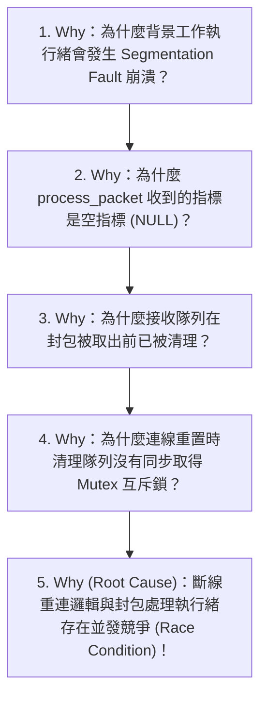

# 🐞 Bug - <% tp.file.title.replace('Bug - ', '') %>

> [!ABSTRACT] ⚡ 30 秒事故速讀 (Post-Mortem Snapshot / TL;DR)
> - 🎯 **問題現象**：一句話描述異常表現（如：在高併發請求下服務拋出 SIGSEGV 崩潰）。
> - 🔍 **根本原因 (Root Cause)**：一句話精煉技術根因（如：未加鎖競爭導致指標被釋放後重複使用 Use-After-Free）。
> - 🛠️ **修復方案 (Fix)**：描述 Patch 作法與 PR 連結 (`pr_link`)。
> - 📊 **事故等級與影響**：`severity` | **受影響版本**：`affected_version` | **修復版本**：`fixed_version`
> - 📌 **專案與負責人**：`project` | 負責人：`assignee` | **狀態**：`status`

---

## 1. 🚨 故障現象與最小重現步驟 (Symptom & Reproduction Profile)

### 1.1 異常表現詳述
- **故障表現 (Symptom)**：
- **觸發環境與條件**（如：OS 版本、特定負載、網路抖動、編譯最佳化等級 `-O2/-O3`）：
- **重現率 (Reproduction Rate)**：100% / 偶發（約 $\quad$ 次出現 1 次）
- **波及範圍 (Blast Radius / Impact)**：
  - [ ] 服務完全中斷 (Service Outage / Crash)
  - [ ] 資料損毀或不一致 (Data Corruption)
  - [ ] 記憶體/CPU 資源持續洩漏 (Resource Leak)
  - [ ] 介面響應延遲超標 (Latency SLA Breach)

### 1.2 最小可重現範例 (Minimal Reproducible Example - MRE)
```bash
# 重現腳本或命令
curl -X POST http://localhost:8080/api/v1/trigger -d '{"payload": "test"}'
```

---

## 2. 📜 錯誤日誌與呼叫堆疊 (Logs, Core Dump & Call Stack)

> [!FAILURE] 🔴 錯誤日誌輸出 / 核心崩潰堆疊 (Stack Trace)
```gdb
#0  0x00007ffff7a2300b in raise () from /lib64/libc.so.6
#1  0x00007ffff7a04855 in abort () from /lib64/libc.so.6
#2  0x0000000000401234 in process_packet (pkt=0x0) at src/network.c:142
#3  0x0000000000401567 in worker_thread (arg=0x7fffffffe000) at src/main.c:89
```

- **崩潰節點 / 關鍵代碼行**：`src/network.c:142`
- **變數異常狀態**：`pkt == NULL`，但在進入函數前未做防禦性校驗。

---

## 3. 🔍 5-Whys 根因分析與機制解析 (5-Whys RCA & Mechanism)

### 3.1 5-Whys 因果鏈推導


1. **Why 1 (現象層)**：
2. **Why 2 (代碼層)**：
3. **Why 3 (並發/記憶體層)**：
4. **Why 4 (架構/邏輯層)**：
5. **Why 5 (根本原因 True Root Cause)**：

---

## 4. 🛠️ 修復方案與 Code Diff (Fix & Pull Request)

### 4.1 修復代碼對比 (Code Diff)
```diff
- void on_disconnect() {
-     queue_clear(&rx_queue);
- }
+ void on_disconnect() {
+     pthread_mutex_lock(&rx_queue.lock);
+     queue_clear(&rx_queue);
+     pthread_mutex_unlock(&rx_queue.lock);
+ }
```

### 4.2 修復方案說明
- **PR 連結**：`pr_link`
- **修復邏輯**：
- **副作用與效能影響評估 (Side Effect & Overhead)**：加鎖開銷 $< 0.5\,\mu\text{s}$，無死鎖 (Deadlock) 風險。

---

## 5. 🛡️ 自動化回歸測試與 CI 防禦防線 (Regression Tests & CI Assertions)

> [!IMPORTANT] 🔁 防呆閉環：任何 Bug 修復都必須伴隨至少一個回歸測試用例！

- [ ] 🧪 **單元測試新增 (Unit Test)**：編寫特定測試重現並驗證此修復（如 `test_concurrent_disconnect()`）
- [ ] 🔍 **靜態/動態分析工具檢核**：
  - [ ] AddressSanitizer (ASan) / LeakSanitizer 檢測通過
  - [ ] ThreadSanitizer (TSan) 競爭檢測通過
  - [ ] Static Linter / Coverity 無警告
- [ ] 🚀 **CI Pipeline 整合**：已納入 GitHub Actions / GitLab CI 自動化測試集

---

## 6. 💎 沉澱為通用軟體防禦原子卡片 (Permanent Notes Distilled)

- 知識提煉沉澱：
  - `[[30_Resources/02_Permanent/Software/Patterns/並發佇列線程安全與無鎖雙緩衝設計]]`
  - `[[30_Resources/02_Permanent/Software/Patterns/防禦性編程與空指針檢查準則]]`
