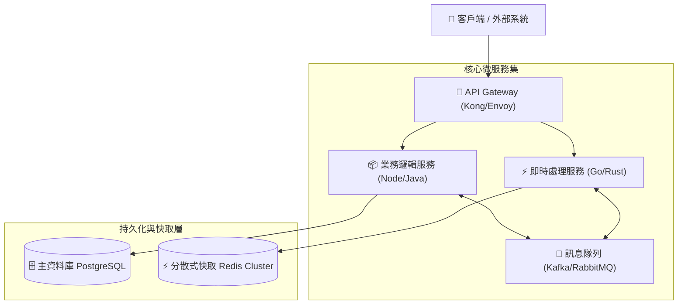
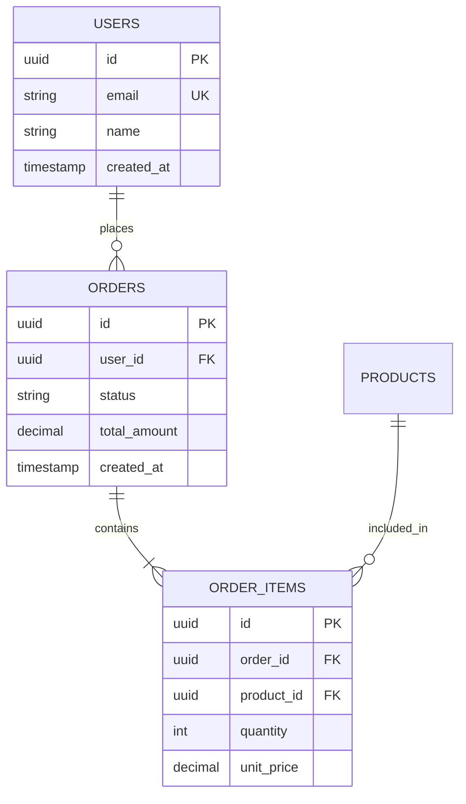

# 🏛️ RFC - <% tp.file.title.replace('RFC - ', '') %>

> [!ABSTRACT] ⚡ 30 秒提案速讀 (RFC Executive Summary / TL;DR)
> - 🎯 **核心提案宗旨**：用一句話闡述本技術提案旨在解決的核心瓶頸與架構重構方向。
> - 📄 **單號與進度**：`rfc_number` ｜ **狀態**：`status` ｜ **目標版本**：`target_release`
> - 👥 **提案作者**：`authors` ｜ **審查委員**：`reviewers` ｜ **關聯專案**：`project`
> - 💡 **核心決策結論**：簡述最終選定的架構方案及其最高價值回報。

---

## 1. 🎯 提案背景與問題陳述 (Context & Problem Statement)

### 1.1 現有系統瓶頸與痛點
- 描述促成此重構/新功能的業務或技術瓶頸（如：單體架構無法橫向擴展、QPS 達到極限、資料一致性難以保證、維護成本過高）。

### 1.2 目標與非目標 (Goals & Non-Goals)
- 🎯 **核心目標 (Goals)**：
  1. 系統吞吐量提升至 $10,000\,\text{RPS}$，P99 延遲 $\le 50\,\text{ms}$。
  2. 達成服務解耦，支援獨立部署與水平擴展。
- 🚫 **非目標 (Explicit Non-Goals)**：
  1. 不在此階段重構舊版資料庫歷史歸檔邏輯。

---

## 2. 🏛️ 提議系統架構設計 (Proposed System Architecture)



---

## 3. 📊 資料模型與儲存設計 (Data Models & Storage Schema)

### 3.1 實體關係圖 (Entity Relationship Diagram - ERD)


### 3.2 資料庫 DDL Schema (SQL)
```sql
CREATE TABLE user_event_logs (
    id BIGSERIAL PRIMARY KEY,
    user_id UUID NOT NULL,
    event_type VARCHAR(64) NOT NULL,
    payload JSONB NOT NULL,
    created_at TIMESTAMPTZ DEFAULT CURRENT_TIMESTAMP
);
CREATE INDEX idx_user_event_created ON user_event_logs (user_id, created_at DESC);
```

---

## 4. 🛡️ 效能、高可用與安全性評估 (Performance, HA & Security)

| 評估維度 | 預期指標 / 設計防線 | 驗證手段 |
| :--- | :--- | :--- |
| **高可用性 (HA)** | 支援跨可用區 (Multi-AZ) 部署，單節點故障無感知 | 混沌工程 (Chaos Monkey) 注入演練 |
| **資料一致性** | 採用 Saga 分散式交易模式確保最終一致性 | 自動化補償交易測試 |
| **安全與權限** | 零信任 (Zero-Trust) mTLS 通訊與 RBAC 權限控管 | 安全滲透測試與代碼審計 |

---

## 5. ⚖️ 備選方案與 Trade-offs 權衡矩陣 (Alternative Solutions Considered)

| 方案維度 | 方案 A: 既有架構小修 | 方案 B: 提議架構 (Selected) | 方案 C: 全託管雲端方案 |
| :--- | :--- | :--- | :--- |
| **開發工期** | 🟢 2 週 | 🟡 6 週 | 🔴 10 週 |
| **擴展性上限** | 🔴 瓶頸明顯 ($1\text{k RPS}$) | 🟢 **高 ($50\text{k RPS}$)** | 🟢 極高 |
| **基礎設施成本** | 🟢 低 | 🟢 **中等預算內** | 🔴 費用高昂 |
| **團隊技術棧** | 🟢 100% 熟悉 | 🟢 **學習曲線平緩** | 🔴 需重新培訓 |

---

## 6. 🚀 實施步驟、遷移與回滾計畫 (Rollout & Migration Plan)

- [ ] **Phase 1 (灰度部署)**：引流 $5\%$ 流量至新架構，監控錯誤率與 P99 延遲
- [ ] **Phase 2 (全量切換)**：逐步提升至 $100\%$，並啟用雙寫校驗
- [ ] 🔄 **回滾計畫 (Rollback Trigger)**：若錯誤率 $> 0.1\%$，立即由 API Gateway 一鍵切回舊版

---

## 7. 📝 審查決策與後續行動 (Review & Implementation)
- 📌 **評審會議**：`[[會議記錄筆記]]`
- 衍生 API 規格：`[[API Spec 筆記]]`
- 關聯架構決策：`[[ADR 決策筆記]]`
