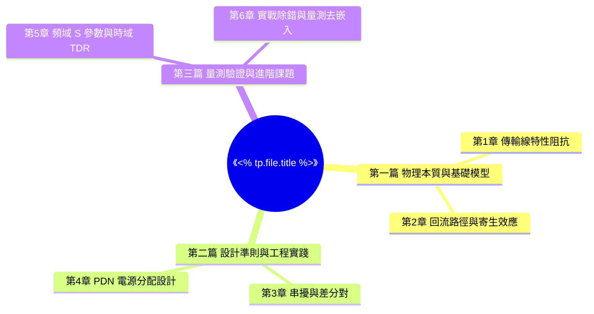

# 📚 《<% tp.file.title %>》精讀筆記

> [!ABSTRACT] ⚡ 30 秒全書精華速讀 (Executive Summary / Big Idea)
> - 💡 **全書核心宗旨 (One-Sentence Thesis)**：
> - 🎯 **目標讀者與解決的工程難題**：
> - 🔑 **3 大核心心智模型 (Top 3 Mental Models)**：
>   1. 
>   2. 
>   3. 
> - 🏆 **最高價值實踐收穫 (Key Takeaway)**：

> [!INFO] 📋 書籍檔案與閱讀狀態 (Book Profile)
> - **作者**：`author`（出版社：`publisher`，`published_year`）
> - **閱讀狀態**：`reading_status` | **頁數**：`total_pages` 頁 | **評分**：⭐⭐⭐⭐⭐
> - **所屬領域**：`category`
> - **推薦延伸主題地圖**：`up`

---

## 1. 🗺️ 全書架構與知識心智導圖 (Book Architecture & Mindmap)



---

## 2. 🔑 核心心智模型與底層規律 (Core Mental Models & Engineering Laws)

### 2.1 心智模型 1：第一性原理與直覺心智 (First-Principles Model)
- **核心規律**：
- **工程經驗法則 (Rule of Thumb)**：
  > *「例如：信號在 FR4 介質中的傳播速度約為 6 inch/ns (15 cm/ns)；走線電感約為 1 nH/mm。」*

### 2.2 心智模型 2：設計權衡與折衷矩陣 (Trade-off Matrix)
| 工程指標 | 追求極致的代價 (Cost / Drawback) | 妥協折衷的最佳平衡點 (Sweet Spot) |
| :--- | :--- | :--- |
| **超高速上升沿 ($t_r$)**| 劇烈的高頻發射與串擾噪訊 | 滿足時序條件下的最慢上升時間 (Slew Rate Control) |
| **過密去耦電容佈局** | 佔用寶貴走線空間與過孔打碎地平面 | 依目標阻抗 ($Z_{target}$) 階梯配置關鍵電容 |

---

## 3. 📖 各篇章結構化精華導讀 (Chapter-by-Chapter Breakdown)

### 3.1 基礎原理篇 (Fundamentals & Principles)
- **核心論點**：
- **關鍵數學推導與物理公式**：
  $$v = \frac{c}{\sqrt{\varepsilon_r}}$$
- **圖解與機制說明**：

### 3.2 設計實踐篇 (Design Guidelines & Applications)
- **核心論點**：
- **工程實務要點**：

### 3.3 進階量測與除錯篇 (Measurement & Advanced Topics)
- **核心論點**：
- **量測實務與避坑技巧**：

---

## 4. 💬 精彩金句與深刻啟發 (Quotes & Insights)

> 💡 *「在極高頻率下，沒有所謂的地平面，只有回流路徑的阻抗分佈。」*
> —— 第 5 章，p.128

> 💡 *「」*

---

## 5. 🛠️ 行動轉化與工程落地清單 (Actionable Takeaways)

> [!IMPORTANT] 🎯 知識轉化為工程實踐
> 將書中洞見具體落實到目前的硬體研發專案與設計規範中。

- [ ] 📋 **更新團隊硬體審查規範**：將第 8 章之差分線換層伴隨地孔規則加入《PCB Layout Checklist》。
- [ ] 🔬 **實驗室儀器校準**：導入 TDR 傳輸線阻抗連續性測試標準作業程序 (SOP)。
- [ ] 📐 **專案設計改進**：在 `[[10_Projects/]]` 專案中驗證新 PDN 去耦電容階梯配置方案。

---

## 6. 💎 衍生永久原子卡片沉澱 (Permanent Notes Distilled)

> [!TIP] 💡 Zettelkasten 原子化提煉
> 依據三階子目錄路由協議（`02_Permanent/Hardware/<L2領域>/<L3專題>/`），將本書精華提煉為獨立原子卡片。

- [ ] `[[30_Resources/02_Permanent/Hardware/SIPI/傳輸線特性阻抗本質與微帶線模型]]`：提煉自本書第 2 章。
- [ ] `[[30_Resources/02_Permanent/Hardware/SIPI/高頻信號回流路徑最小電感原理]]`：提煉自本書第 4 章。
- [ ] `[[30_Resources/02_Permanent/Hardware/PCB/差分對等長與伴隨接地孔佈線規範]]`：提煉自本書第 7 章。

---

## 7. 🔍 智慧動態反向關聯 (Backlinks Explorer)

```dataview
TABLE file.folder AS "所屬目錄", type AS "類型", status AS "狀態", file.mtime AS "最後更新"
FROM [[]]
WHERE file.name != this.file.name
SORT file.mtime DESC
LIMIT 10
```
