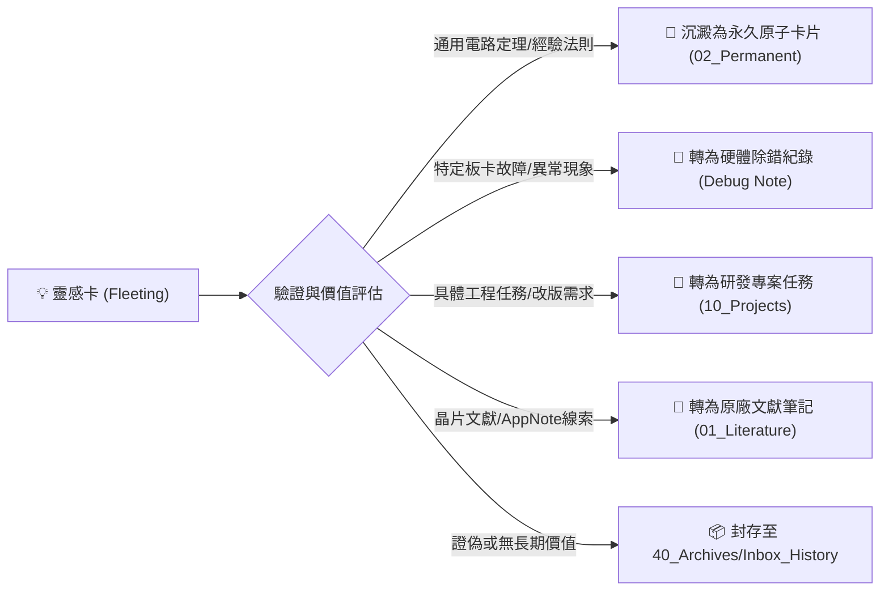

# 💡 <% tp.file.title %>

> [!QUOTE] ⚡ 30 秒閃電捕捉 (Flash Capture / Raw Spark)
> 用 1~2 句話直擊原始靈感、反常現象、未解疑點或突發直覺假說。

> [!INFO] 📋 靈感情境與轉化目標 (Capture Profile)
> - **觸發場合**：`capture_context` | **優先級**：`priority`
> - **預期轉化方向**：`target_category`（永久筆記 / 專案任務 / 除錯紀錄 / 文獻精讀）
> - **捕捉時間**：`created`

---

## 1. 🔍 觀察現象與觸發脈絡 (Context & Triggering Observation)

### 1.1 觸發場景與上下文 (Where & When)
- **當前正在進行的工作**：例如在進行 `[[10_Projects/]]` 點亮測試、研讀文獻時觸發。
- **觀察到的反常現象或技術疑問**：

---

## 2. 🧪 工作假說與底層推測 (Working Hypothesis & Physics)

### 2.1 假說陳述 (Scientific Hypothesis)
> [!TIP] 💡 假說結構化句型
> - **條件 (If)**：
> - **結果 (Then)**：
> - **底層機制 (Because)**：

### 2.2 初步直覺與理論支撐
- 

---

## 3. 🔬 快速驗證實驗方案 (Quick Validation Experiment)

- [ ] **低成本驗證步驟 1 (Quick Test / Sim)**：例如 SPICE 簡易電路模擬、示波器單點量測、查閱晶片手冊特性曲線。
- [ ] **量測/驗證步驟 2 (Empirical Check)**：
- **驗證通過標準 (Success / Go-No-Go Criteria)**：

---

## 4. 🧭 分流決策與轉化待辦 (Triage & Next Actions)

### 4.1 具體轉化行動清單 (Action Items)
- [ ] 🎯 **轉化任務 1**：
- [ ] 🎯 **轉化任務 2**：

---

## 5. 📦 收集箱 Inbox Zero 與無損封存協議 (Inbox Zero Lifecycle)

> [!SUCCESS] 📦 已完成提煉與分流 (Processed)
> 當本張靈感卡完成驗證與分流後：
> 1. 在此 Callout 註明衍生之卡片（例如：`[[衍生之永久卡片]]` 或 `[[10_Projects/關聯專案]]`）。
> 2. 將 Frontmatter `status` 改為 `processed`。
> 3. 將本檔案自 `00_Inbox/` 搬移至 `40_Archives/Inbox_History/`，達成 Inbox Zero。
