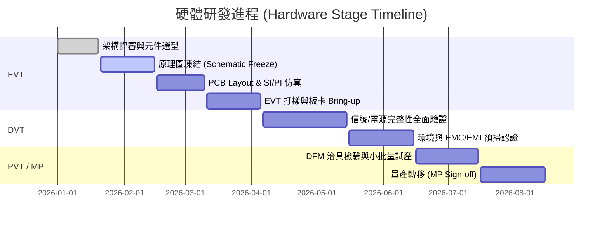

# 🚀 <% tp.file.title %>

> [!INFO] 📊 專案總覽與健康度看板 (Project Dashboard)
> - **專案代號**：`project_code` ｜ **專案負責人**：`lead`
> - **當前階段**：`stage` ｜ **專案健康度**：`health`
> - **交付目標日**：`deadline` ｜ **所屬領域**：`area`
> - **關鍵設計約束**：`pcb_layers` 層板 ｜ 目標 BOM 成本：`target_bom_cost`
> - **當前關鍵路徑 (Critical Path)**：描述目前最核心的推進事項或潛在阻礙。

---

## 🎯 專案目標與驗收指標 (SMART Goals & Deliverables)

| 核心維度 | 目標陳述 (Specification) | 驗收標準 (Acceptance Criteria) | 達成狀態 |
| :--- | :--- | :--- | :---: |
| **功能與效能** | 核心電源轉換效率 $\ge 92\%$，輸出紋波 $\le 20\text{mV}_{p-p}$ | 示波器 20MHz 頻寬限制滿載量測 | ⏳ 進行中 |
| **信號完整性** | PCIe Gen3 / USB 3.2 眼圖張開度符合規範，Jitter $\le 0.15\text{UI}$ | EVT 示波器眼圖測試報告 | ⏳ 進行中 |
| **熱與可靠度** | 滿載結溫 $T_J \le 95^\circ\text{C}$，降額符合 EE 規範 | 熱像儀量測 + 降額計算書驗收 | ⏳ 進行中 |
| **BOM 與成本** | 總硬體 BOM 成本控管於目標預算內 | 採購核價與 Second Source 清單確認 | ⏳ 進行中 |

---

## 🏁 硬體階段門與里程碑 (Stage-Gate Milestones)



### 階段檢核清單 (Stage-Gate Checklists)

#### 🚩 Phase 1: EVT (Engineering Validation Test)
- [ ] 📝 **架構評審完成**：關鍵晶片選型、架構決策 ADR [[ADR - 拓撲選型]] 通過
- [ ] ⚡ **原理圖凍結 (Schematic Freeze)**：通過 4 大 EE Review 準則（降額、保護、時序）
- [ ] 📐 **Layout 凍結**：SI/PI 仿真報告通過、疊構回流路徑無跨分割、過孔伴隨地孔配置完備
- [ ] 🔬 **EVT Board Bring-up**：電源各路無短路、上電時序正確、晶振起振正常

#### 🚩 Phase 2: DVT (Design Validation Test)
- [ ] 📊 **SI/PI 實測通過**：高速差分眼圖、DCDC 輸出動態響應與紋波量測合規
- [ ] 🌡️ **熱與環境應力**：高低溫循環測試 (-20°C ~ +70°C) 滿載無熱當死機
- [ ] 🛡️ **EMC/EMI 預掃**：RE/CE 測試通過，具備 3dB 以上 Margin

#### 🚩 Phase 3: PVT & MP (Production Validation & Mass Production)
- [ ] 🏭 **DFM / DFA 審查**：SMT 產線組裝評估無元件干涉，鋼網與焊盤優化
- [ ] 🧪 **產線測試治具 (ICT/FCT)**：測試點覆蓋率 $\ge 90\%$，自動化測試程式上線
- [ ] 📦 **BOM 凍結與雙來源**：主被動關鍵元件均具備 Second-Source 驗證

---

## 📝 待辦工作清單 (WBS Action Tasks)

### 🔴 高優先級 (P0 / P1 - Blockers & Critical Path)
- [ ] 

### 🟡 一般任務 (P2 - Normal Progress)
- [ ] 

---

## 📂 硬體設計資產與外部連結 (Hardware Assets & Repos)

| 資產類型 | 檔案位置 / 連結 | 負責人 | 備註 / 版本 |
| :--- | :--- | :--- | :--- |
| **原理圖 (Schematic)** | `[[90_System/Attachments/]]` 或 雲端路徑 | | Rev 1.0 |
| **PCB 圖檔 (BRD/Layout)** | `[[90_System/Attachments/]]` 或 雲端路徑 | | Rev 1.0 |
| **BOM 成本表** | `[[90_System/Attachments/]]` 或 試算表連結 | | Ver 0.9 |
| **測試計畫與報告** | `[[90_System/Attachments/]]` | | EVT Test Plan |

---

## 🔬 專案相關硬體除錯與 Issue (Debug Issues)

```dataview
TABLE 
    severity AS "嚴重度",
    issue_type AS "類型",
    board_rev AS "板本",
    status AS "狀態",
    eco_number AS "ECO 編號"
FROM "30_Resources/02_Permanent"
WHERE project = "<% tp.file.title %>" OR contains(file.tags, "<% tp.file.title %>")
SORT file.mtime DESC
```

---

## ⚖️ 相關架構決策記錄 (Architecture Decisions - ADR)

```dataview
TABLE 
    decision_date AS "決策日期",
    status AS "狀態",
    category AS "分類",
    decision_makers AS "決策者"
FROM "30_Resources/02_Permanent"
WHERE project = "<% tp.file.title %>" OR contains(tags, "Decision/ADR") AND contains(file.tags, "<% tp.file.title %>")
SORT file.name ASC
```

---

## 👥 相關評審與專案會議 (Meetings)

```dataview
TABLE 
    date AS "日期",
    meeting_type AS "會議類型",
    attendees AS "參與人員"
FROM "20_Areas" OR "10_Projects"
WHERE project = "<% tp.file.title %>" OR contains(tags, "Meeting") AND contains(file.tags, "<% tp.file.title %>")
SORT date DESC
```

---

## 🏁 專案結案覆盤與知識沉澱 (Post-Mortem & Retrospective)
> 專案量產或結案後填寫（將 Frontmatter 狀態改為 `status: completed`，並將本筆記移至 `40_Archives/Projects/` 封存）：
- 🏆 **亮點成就與指標超越**：
- ⚠️ **重大技術踩坑與教訓 (Lessons Learned)**：
- 💎 **提煉沉澱至知識庫的原子方法論卡片**：
  - [[沉澱方法論卡片 1]]
  - [[沉澱方法論卡片 2]]
